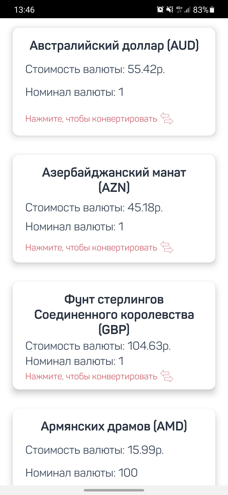
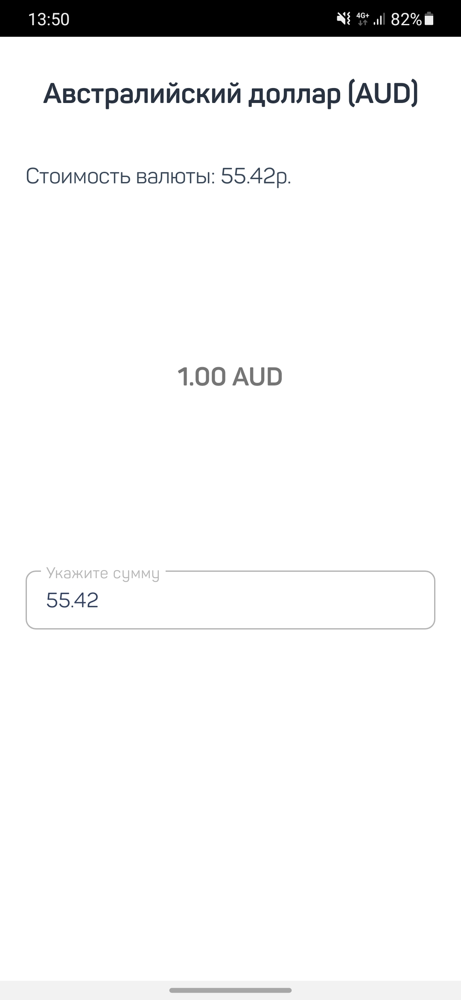
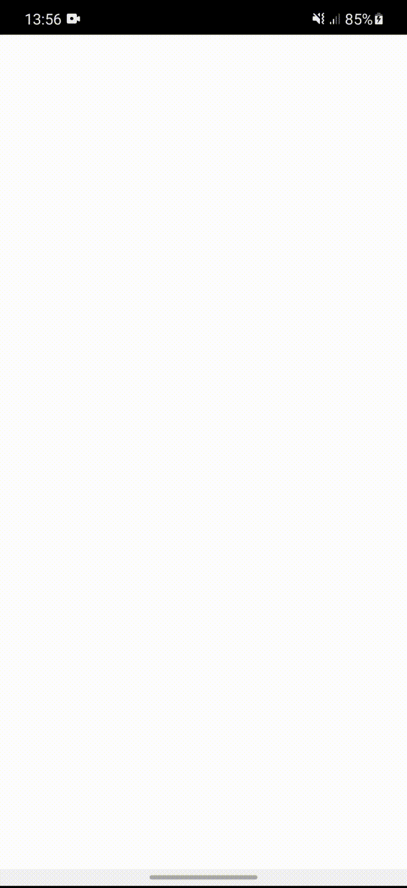
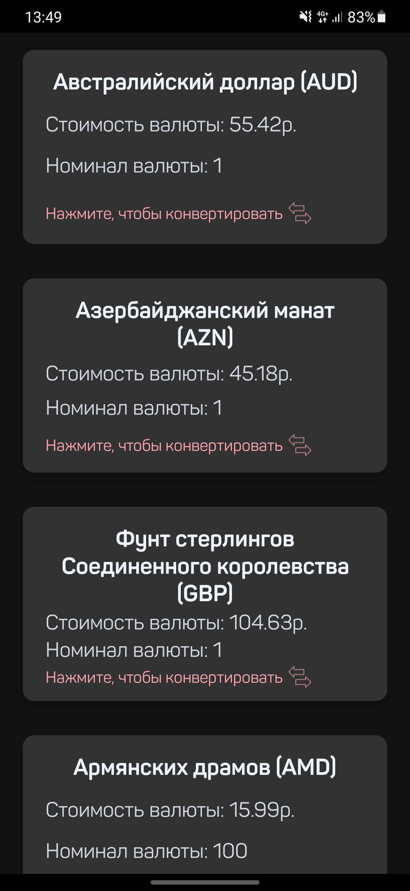
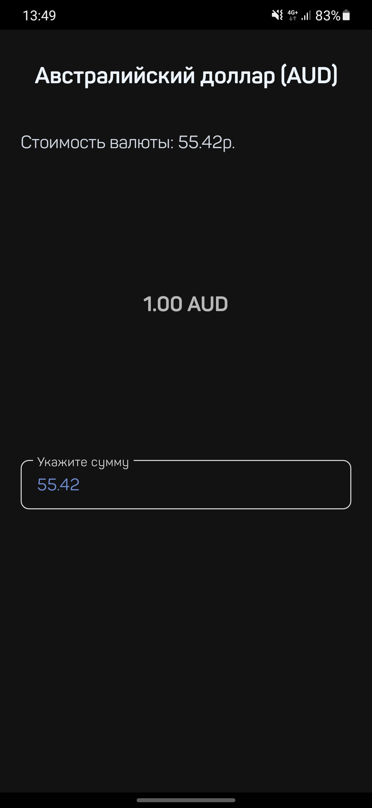
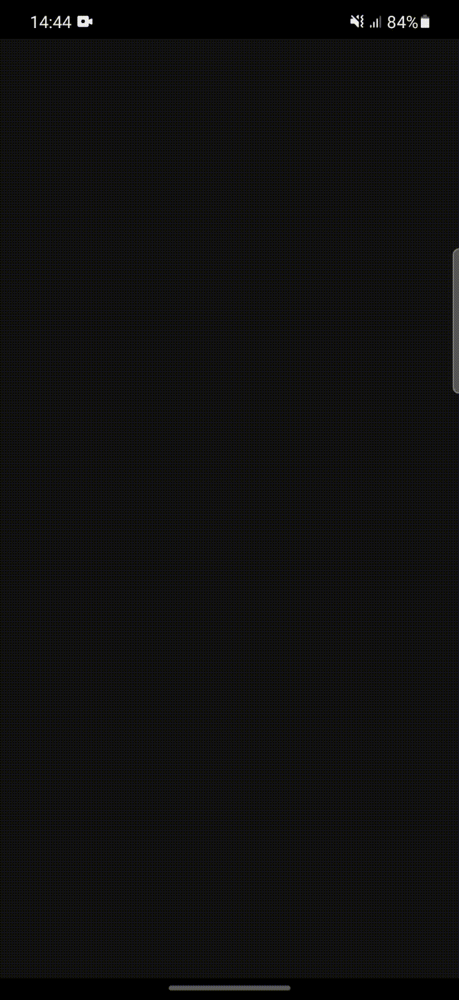

# CFT application

Apk in folder release

## Stack
- Dagger 2
- MVVM
- Room
- LiveData
- Retrofit
- Navigation Component
- WorkerManager

## Preview Light

&shy;

&shy;

## Preview Dark

&shy;

&shy;

